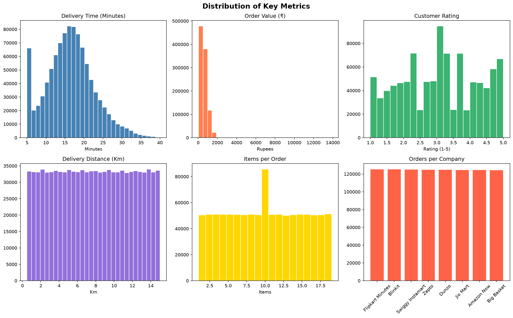
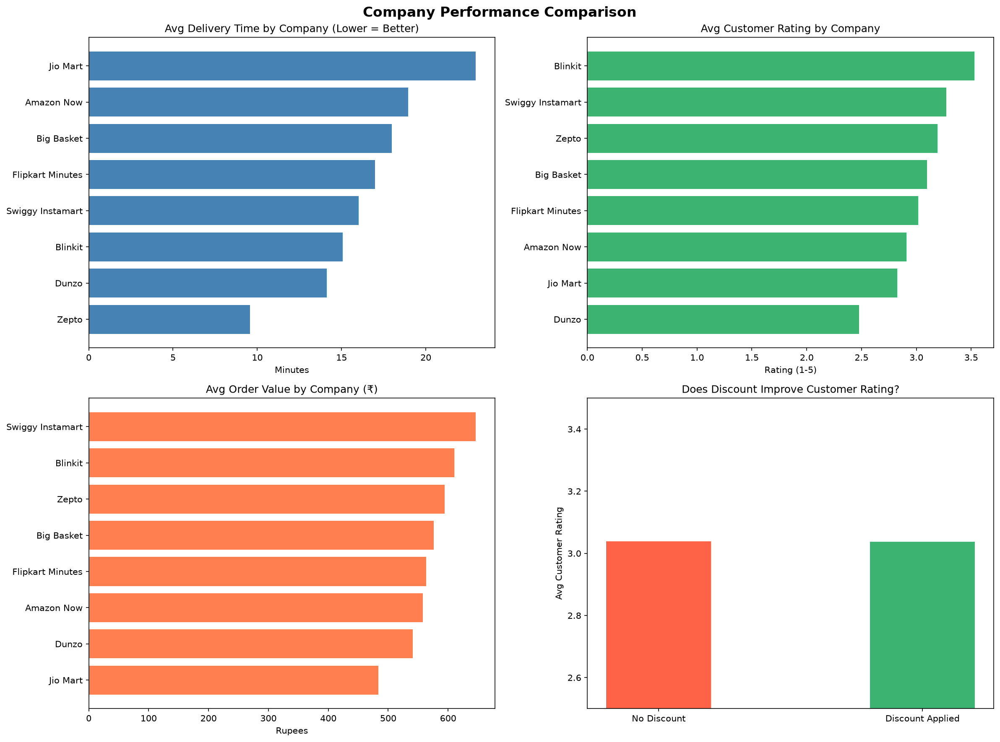
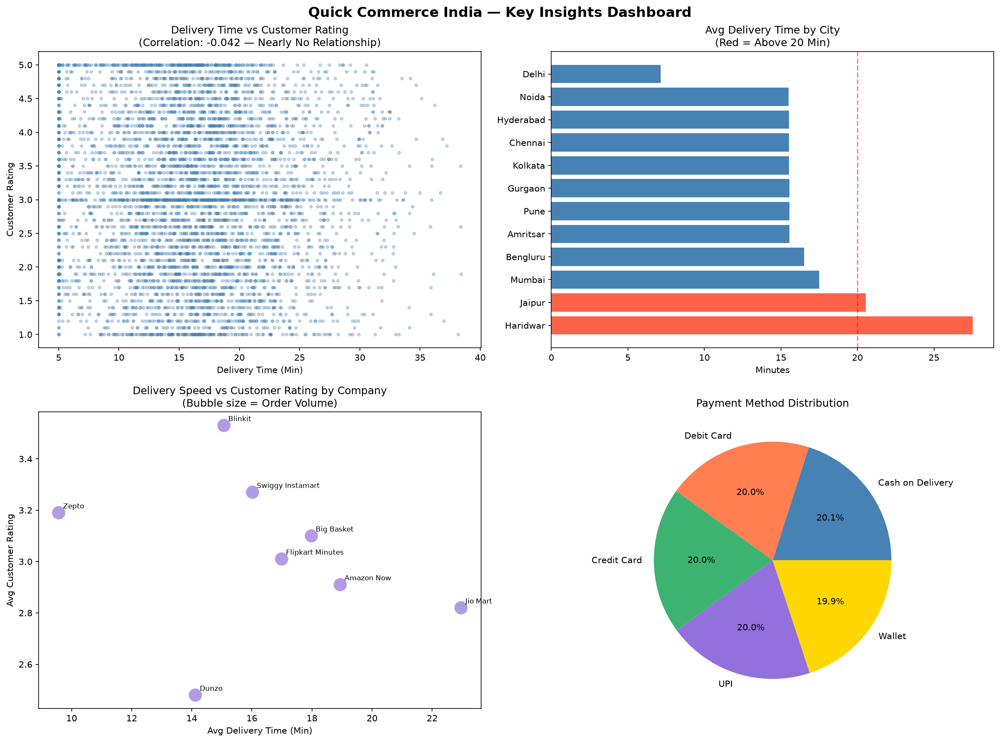

# Quick Commerce Performance Analysis — India


**Tools:** Python, Pandas, NumPy, Matplotlib, Seaborn, Jupyter Notebook, Excel, PivotTables  
**Dataset:** 1,000,000 Orders · 8 Platforms · 13 Features

---

## Project Overview

Exploratory Data Analysis on 1 million quick commerce orders across 8 Indian platforms — Blinkit, Zepto, Swiggy Instamart, Amazon Now, Flipkart Minutes, BigBasket, and 2 others. 

Analyzed delivery speed, customer satisfaction, order value, and platform performance to identify what actually drives ratings. 

This repo includes both: 
1.  **Python EDA** - Deep statistical analysis with Jupyter Notebook
2.  **Excel Executive Dashboard** - Interactive dashboard for business stakeholders

---

## Business Questions Answered

- Does faster delivery lead to higher customer ratings?
- Which platform performs best across speed, rating, and order value?
- Do discounts improve customer satisfaction?
- Which cities have the slowest delivery times?

---

## Key Findings

| Finding | Detail |
|---------|--------|
| **Speed ≠ Satisfaction** | Pearson r = 0.042 — near-zero correlation between delivery time and rating |
| **Fastest Platform** | Zepto (~9.5 min avg delivery) — but not highest rated |
| **Highest Rated** | Blinkit (avg 3.53/5) |
| **Highest Order Value** | Swiggy Instamart (₹646 avg) |
| **Discounts Don't Help** | No meaningful improvement in customer ratings with discounts |
| **Slowest Cities** | Haridwar (27.5 min avg), Jaipur (20.5 min avg) |

---

## Key Skills Demonstrated

- Data Cleaning & Aggregation with Pandas on 1M+ rows
- Exploratory Data Analysis & Statistical Correlation
- Data Visualization with Matplotlib & Seaborn  
- Excel Dashboarding: PivotTables, Slicers, Conditional Formatting, Heatmaps, Combo Charts
- Business Insight Communication for executive decision-making

---

## Analysis Structure

- **Univariate EDA** — distributions of delivery time, order value, ratings across platforms
- **Bivariate EDA** — correlation analysis, platform vs. rating, speed vs. satisfaction
- **Excel Dashboard** — interactive view with filters for City and Company
- **Insights Dashboard** — consolidated visual summary of key findings

---

## Visuals

### 1. Univariate EDA
Distribution of key metrics across platforms


### 2. Bivariate EDA
Correlation and platform comparison analysis


### 3. Excel Executive Dashboard
Interactive dashboard with slicers and heatmap


---

## Repository Files

| File | Description |
|------|-------------|
| `quick_commerce_eda.ipynb` | Full EDA notebook with code and outputs |
| `QuickCommerce_Executive_Dashboard.xlsx` | Interactive Excel dashboard with slicers and charts |
| `univariate_eda.png` | Distribution plots |
| `bivariate_eda.png` | Correlation and comparison plots |
| `insights_dashboard.png` | Screenshot of Excel dashboard |

---

## How to Use

1. Clone the repo 
   ```bash
   git clone https://github.com/ankita-halabanur/quick-commerce-performance-analysis.git
